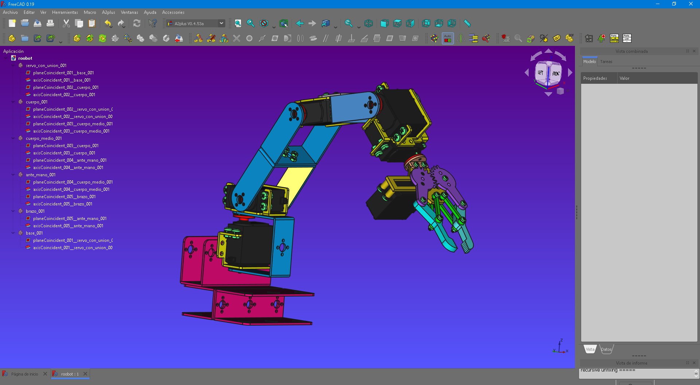

# 6_DoF_Robot

 This is a 6 DoF robot

## [ensambles](ensambles)
This folder contains a Freecad file with 1 DoF

## [piezas](piezas) & [robot_tool](robot_tool)
This folder contains every piece of the project

## [roobot](roobot.FCStd)
This is the assembled robot 

## [Thingiverse](Thingiverse)
This folder contains a Thingiverse files
